# 高校班级事务管理系统 - 数据流图（DFD）

## 目录
- [Level 0：系统上下文图](#level-0系统上下文图)
- [Level 1：系统整体数据流](#level-1系统整体数据流)
- [Level 2：各模块详细流程](#level-2各模块详细流程)
- [核心数据存储清单](#核心数据存储清单)

---

## Level 0：系统上下文图

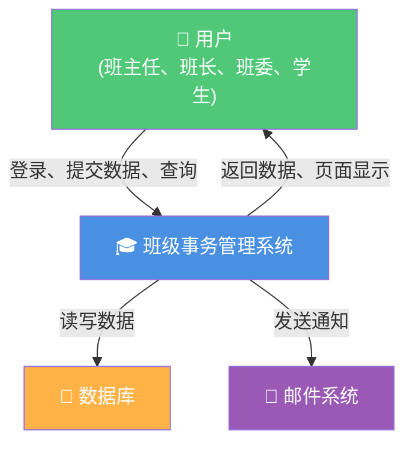

---

## Level 1：系统整体数据流

```mermaid
graph TB
    User["👤 用户"]
    
    Auth["🔐 身份认证"]
    UserMgmt["👥 用户管理"]
    ClassMgmt["🏫 班级信息管理"]
    Notice["📢 通知公告"]
    Learning["📚 学习管理"]
    Finance["💰 班费管理"]
    Activity["🎉 活动管理"]
    Leave["✈️ 请销假管理"]
    Discipline["📋 纪律管理"]
    Vote["🗳️ 评优投票"]
    Report["📊 统计报表"]
    Log["📝 操作日志"]
    
    UserDB[("👤 用户表")]
    ClassDB[("🏫 班级表")]
    NoticeDB[("📢 通知表")]
    LearningDB[("📚 学习表")]
    FinanceDB[("💰 班费表")]
    ActivityDB[("🎉 活动表")]
    LeaveDB[("✈️ 请假表")]
    DisciplineDB[("📋 纪律表")]
    VoteDB[("🗳️ 投票表")]
    LogDB[("📝 日志表")]
    
    User -->|登录| Auth
    Auth -->|验证| UserDB
    Auth -->|返回| User
    
    User -->|管理操作| UserMgmt
    UserMgmt -->|R/W| UserDB
    UserMgmt -->|记录| LogDB
    
    User -->|查看修改| ClassMgmt
    ClassMgmt -->|R/W| ClassDB
    ClassMgmt -->|记录| LogDB
    
    User -->|发布查询| Notice
    Notice -->|R/W| NoticeDB
    Notice -->|记录| LogDB
    
    User -->|维护查询| Learning
    Learning -->|R/W| LearningDB
    Learning -->|记录| LogDB
    
    User -->|记录审核| Finance
    Finance -->|R/W| FinanceDB
    Finance -->|记录| LogDB
    
    User -->|发布报名| Activity
    Activity -->|R/W| ActivityDB
    Activity -->|记录| LogDB
    
    User -->|申请审核| Leave
    Leave -->|R/W| LeaveDB
    Leave -->|记录| LogDB
    
    User -->|登记审核| Discipline
    Discipline -->|R/W| DisciplineDB
    Discipline -->|记录| LogDB
    
    User -->|投票统计| Vote
    Vote -->|R/W| VoteDB
    Vote -->|记录| LogDB
    
    User -->|查看报表| Report
    Report -->|查询| NoticeDB
    Report -->|查询| FinanceDB
    Report -->|查询| ActivityDB
    Report -->|查询| LeaveDB
    Report -->|查询| DisciplineDB
    Report -->|查询| LearningDB
    Report -->|查询| VoteDB
    
    style User fill:#50C878,color:#fff
    style Auth fill:#FF6B6B,color:#fff
    style Report fill:#4ECDC4,color:#fff
    style Log fill:#95A5A6,color:#fff
    
```

---

## Level 2：各模块详细流程

### 6.1 身份认证与用户登录

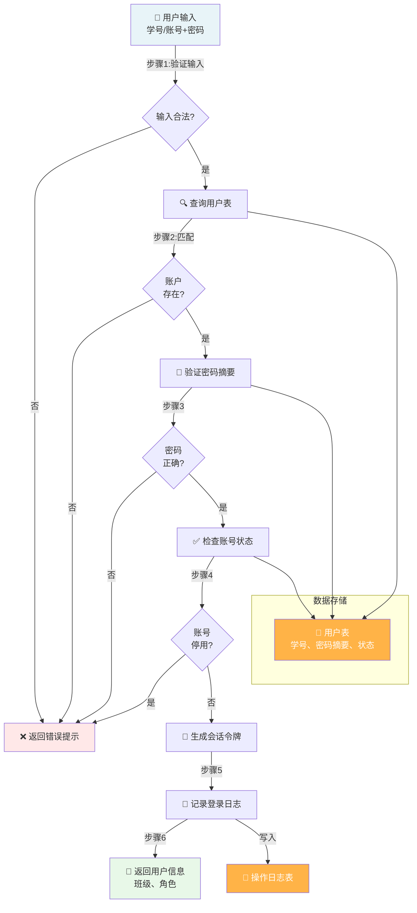

### 6.2 用户与权限管理

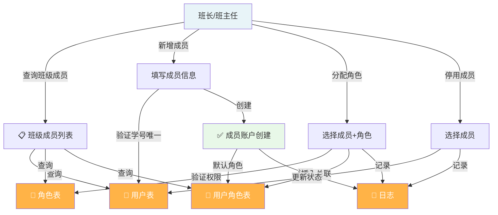

### 6.3 通知公告管理

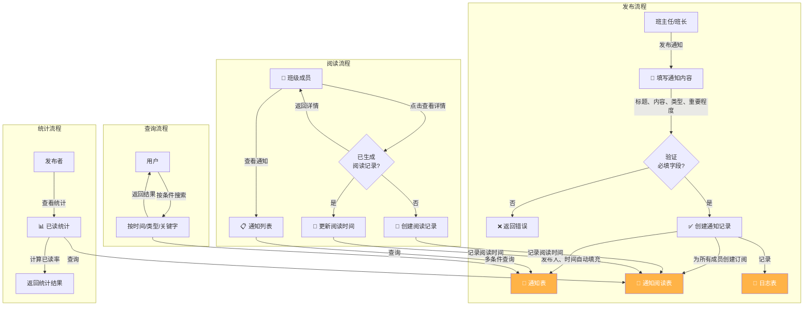

### 6.4 班费管理

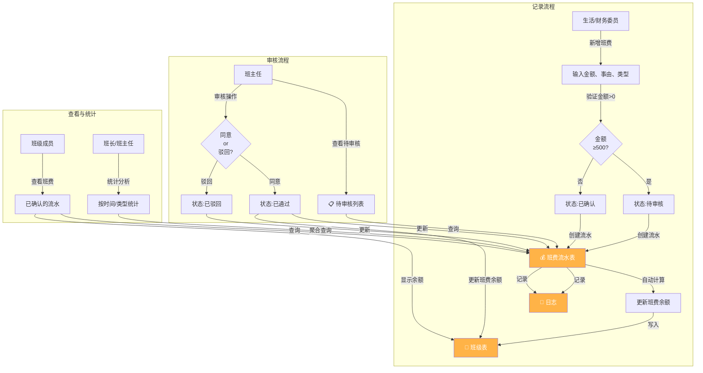

### 6.5 活动管理

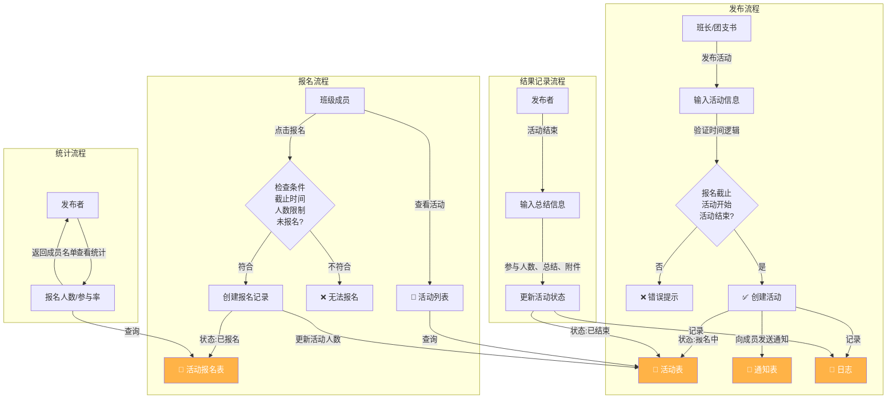

### 6.6 请销假管理

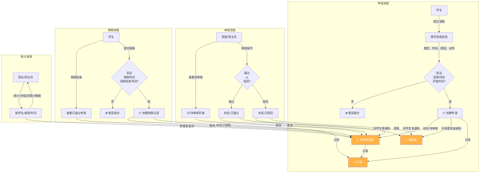

### 6.7 纪律管理

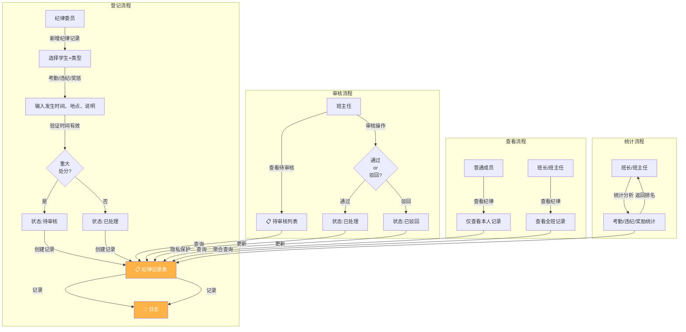

### 6.8 学习管理

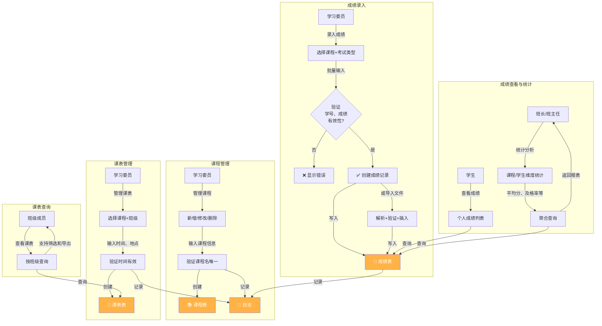

### 6.9 评优投票管理

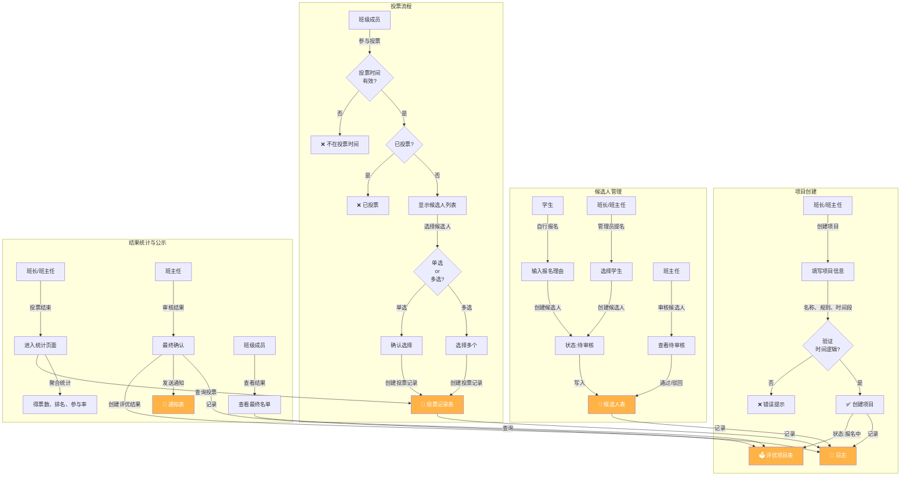

### 6.10 统计报表

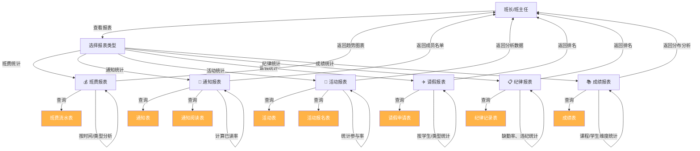

### 6.11 操作日志

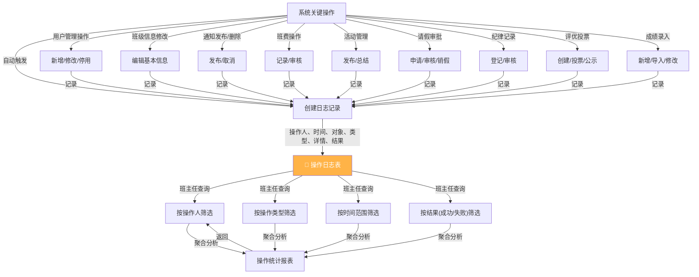

---

## 核心数据存储清单

| 序号 | 数据存储 | 标识符 | 主要数据 | 来源 | 使用者 |
|-----|--------|--------|--------|------|--------|
| 1 | 👤 用户表 | D1 | 学号、姓名、性别、手机、邮箱、密码、状态 | 班长/班主任 | 全系统 |
| 2 | 🔐 角色表 | D2 | 角色名称、权限说明 | 班长/班主任 | 权限控制模块 |
| 3 | 🔗 用户角色表 | D3 | 用户编号、角色编号、授权时间 | 班长/班主任 | 权限验证 |
| 4 | 🏫 班级表 | D4 | 班级编号、名称、学院、专业、班主任、余额 | 班长/班主任 | 全系统 |
| 5 | 📢 通知表 | D5 | 通知编号、标题、内容、发布人、时间、类型、重要程度 | 班主任/班长 | 通知模块 |
| 6 | 📖 通知阅读表 | D6 | 通知编号、用户编号、阅读时间 | 系统自动 | 统计模块 |
| 7 | 📚 课程表 | D7 | 课程编号、名称、教师、类型、学分 | 学习委员 | 学习模块 |
| 8 | 📅 课表表 | D8 | 课表编号、课程编号、班级编号、时间、地点 | 学习委员 | 课表查询 |
| 9 | 📖 成绩表 | D9 | 成绩编号、学生编号、课程编号、成绩、考试类型、录入人 | 学习委员 | 成绩统计 |
| 10 | 💰 班费流水表 | D10 | 流水编号、收支类型、金额、事由、经办人、时间、凭证、审核状态 | 财务委员 | 班费模块 |
| 11 | 🎉 活动表 | D11 | 活动编号、名称、地点、时间、报名截止、人数限制、状态 | 班长/团支书 | 活动模块 |
| 12 | 📝 活动报名表 | D12 | 活动编号、用户编号、报名时间、状态 | 班级成员 | 活动统计 |
| 13 | ✈️ 请假申请表 | D13 | 请假编号、申请人、类型、时间、原因、证明、审核状态 | 学生 | 请假模块 |
| 14 | 📝 销假记录表 | D14 | 销假编号、请假编号、销假时间、状态 | 学生 | 请假统计 |
| 15 | 📋 纪律记录表 | D15 | 记录编号、学生编号、类型、发生时间、地点、说明、审核状态 | 纪律委员 | 纪律模块 |
| 16 | 🗳️ 评优项目表 | D16 | 项目编号、名称、说明、时间段、投票规则、创建人、状态 | 班长/班主任 | 投票模块 |
| 17 | 👤 候选人表 | D17 | 项目编号、用户编号、推荐理由、审核状态 | 学生/班长 | 投票模块 |
| 18 | 📝 投票记录表 | D18 | 项目编号、投票人、候选人编号、投票时间 | 班级成员 | 统计分析 |
| 19 | 📝 操作日志表 | D19 | 日志编号、操作人、操作对象、操作类型、操作时间、详情、结果 | 系统自动 | 审计追溯 |
| 20 | 🏫 班级成员表 | D20 | 班级编号、用户编号、加入时间、成员状态 | 班长/班主任 | 成员查询 |

---

## 关键数据流说明

### 时间检查与验证规则

| 数据流 | 验证规则 | 触发时机 |
|--------|---------|---------|
| 请假申请 | 结束时间 > 开始时间 | 提交时 |
| 销假记录 | 销假时间 > 请假结束时间 | 销假时 |
| 活动报名 | 报名时间 ≤ 报名截止时间 < 活动开始时间 < 活动结束时间 | 报名和活动创建时 |
| 投票 | 当前时间在投票开始和结束时间内 | 投票时 |
| 班费审核 | 金额 ≥ 500元为大额支出 | 记录创建时 |

### 状态转移规则

| 业务对象 | 状态流转 | 说明 |
|---------|---------|------|
| 班费流水 | 待审核 → 已通过/已驳回 → 已确认 | 大额支出需班主任审核 |
| 请假申请 | 待审核 → 已通过/已驳回 → 已销假 | 审核通过后才可销假 |
| 纪律记录 | 待审核 → 已处理/已驳回 | 重大处分需班主任审核 |
| 候选人 | 待审核 → 已通过/已驳回 | 班主任审核候选人资格 |
| 活动 | 报名中 → 进行中 → 已结束 | 自动或手动状态转移 |
| 通知 | 正常 → 已过期/已删除 | 时间自动过期或手动删除 |

### 权限隔离与数据访问

| 模块 | 班主任 | 班长 | 班委 | 普通成员 |
|-----|-------|------|------|---------|
| 用户管理 | R/W | R/W | - | - |
| 班级信息 | R/W | R/W | R | R |
| 通知发布 | R/W | R/W | R/W（授权）| R |
| 班费审核 | R/W | R | - | R（已确认）|
| 请假审核 | R/W | R/W | R/W | 仅自己 |
| 评优最终审核 | R/W | - | - | 仅查看公示 |
| 纪律审核 | R/W | - | - | 仅自己 |
| 操作日志 | R/W | R | - | - |

---

## 系统数据流总结

- **用户入口**：登录（身份认证）→ 权限验证 → 功能菜单
- **业务流程**：用户操作 → 数据验证 → 数据存储 → 自动日志记录 → 返回结果
- **查询统计**：多维度查询 → 聚合计算 → 报表生成 → 导出
- **审计追溯**：所有关键操作自动记录日志 → 班主任查询分析 → 数据追踪

---

*此DFD文档与《功能需求细化.md》对应，可作为数据库设计和业务流程分析的基础。*
